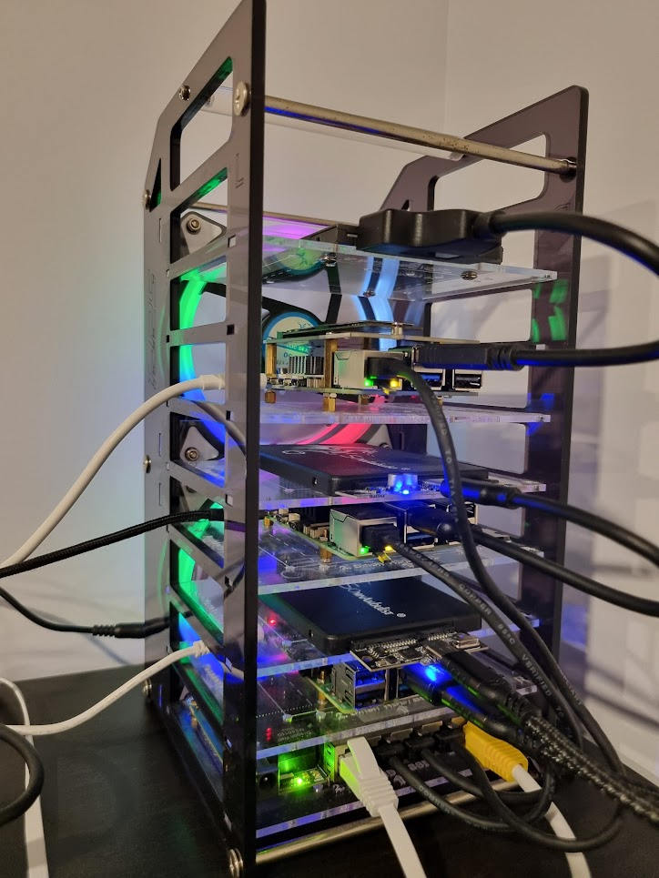
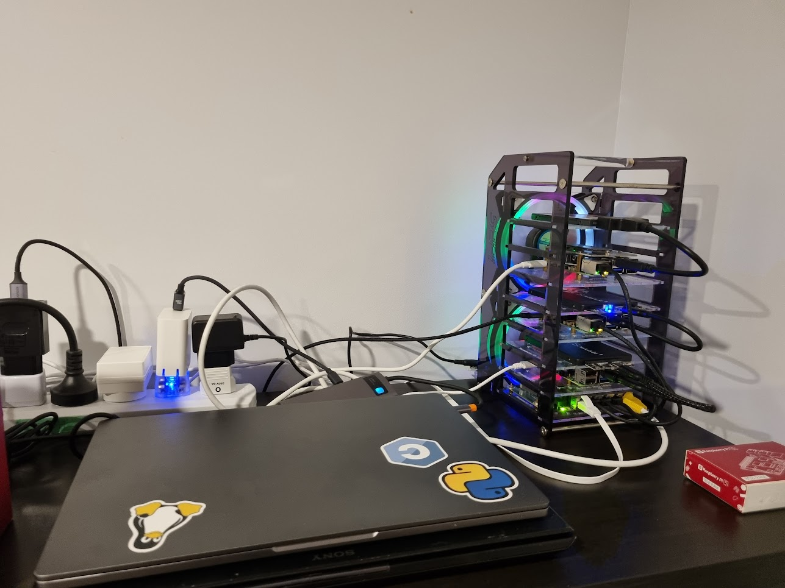

# Malinka


This is a homelab project to build a Kubernetes cluster on top of Raspberry Pis and retired laptops.

*Malinka stands for "little raspberry" in Russian*




## Setup a control node

### Devcontainer
Use devcontainer to setup a control node with ansible and other dependencies.

## Install K8S cluster with kubespray

```sh
ansible-playbook  playbooks/kubespray/kubespray-playbook.yaml
## if necessary to clean up from previous installation
ansible-playbook  playbooks/kubespray/reset.yaml
```

### Install cluster services

```sh
# rancher
cat k8s/cluster/rancher--local-path-provisioner/README.md

# setup cert-manager Let's Encrypt staging issuer
kubectl apply -f k8s/cluster/cert-manager/.

# install and setup kong gateway
cat k8s/cluster/kong/README.md
```

